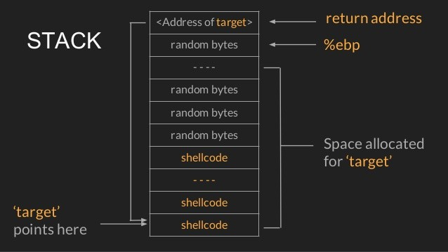

# Windows Shellcode Injection

This project demonstrates two methods of shellcode injection on Windows: self-injection and process injection. The provided examples show how to inject and execute shellcode in a process's memory space using the Windows API.

## Disclaimer

This code is for educational purposes only. Misuse of this code can lead to severe consequences. Use it responsibly and only on systems you have permission to test.

## Overview

- **Self-Injection:** Injects and executes shellcode within the same process.
- **Process Injection:** Injects and executes shellcode into a remote process (`mspaint.exe`).

## Prerequisites

- Windows Operating System
- Visual Studio or any C++ compiler that supports Windows API

## Compiling

To compile the code, use a C++ compiler such as Visual Studio:

1. Open the project in Visual Studio.
2. Ensure that you have set the project to compile as a C++ application.
3. Build the project.

## Self-Injection

Self-injection is the process of injecting and executing shellcode within the same process. The provided example shows how to allocate memory, write shellcode into it, and create a thread to execute the shellcode.

### Code Explanation

- **Memory Allocation:** Allocates memory using `VirtualAlloc`.
- **Shellcode Writing:** Writes the shellcode to the allocated memory using `RtlCopyMemory`.
- **Thread Creation:** Creates a thread to execute the shellcode using `CreateThread`.

### Usage

1. Compile the code.
2. Run the compiled executable.
3. The shellcode (a message box) will execute within the same process.

## Process Injection

Process injection is the technique of injecting and executing shellcode into a remote process. The provided example shows how to find a target process (`mspaint.exe`), allocate memory in it, write the shellcode, and create a remote thread to execute the shellcode.

### Code Explanation

- **Process Enumeration:** Uses `CreateToolhelp32Snapshot` and `Process32First/Process32Next` to find the target process.
- **Memory Allocation:** Allocates memory in the target process using `VirtualAllocEx`.
- **Shellcode Writing:** Writes the shellcode into the target process's memory using `WriteProcessMemory`.
- **Thread Creation:** Creates a remote thread to execute the shellcode using `CreateRemoteThread`.

### Usage

1. Compile the code.
2. Ensure `mspaint.exe` is running.
3. Run the compiled executable.
4. The shellcode (a message box) will execute within `mspaint.exe`.

## Shellcode

The provided shellcode examples are simple message boxes:

- **Self-Injection Shellcode:** x86 message box shellcode.
- **Process Injection Shellcode:** x64 message box shellcode.

## Notes

- Ensure the target process (`mspaint.exe`) is running before executing the process injection code.
- The shellcode provided is for demonstration purposes only and may need to be adapted for other use cases.

